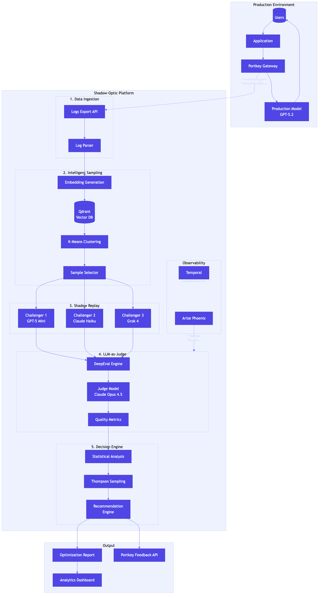

# Shadow-Optic

**Autonomous Cost-Quality Optimization Engine for Large Language Models**

Shadow-Optic is an enterprise-grade optimization platform that continuously evaluates whether lower-cost LLM models can replace production models without sacrificing output quality. Operating entirely in shadow mode, it replays sampled production traffic against challenger models and uses LLM-as-Judge evaluation to provide actionable switching recommendations.

---

## Overview

Organizations running LLMs in production face a fundamental challenge: balancing cost efficiency with output quality. Shadow-Optic addresses this by providing automated, continuous evaluation of alternative models against real production workloads.

The system operates transparently alongside existing infrastructure, requiring no changes to production traffic flow. All evaluation happens asynchronously using historical logs, ensuring zero impact on end-user experience.

### Core Capabilities

- **Shadow Mode Evaluation**: Test challenger models against production traffic without affecting users
- **Intelligent Sampling**: Semantic stratified sampling reduces evaluation costs by 95% while maintaining statistical validity
- **LLM-as-Judge Quality Assessment**: Automated evaluation of faithfulness, quality, and conciseness
- **Durable Workflow Orchestration**: Fault-tolerant execution with automatic retries via Temporal
- **Cost-Benefit Analysis**: Clear recommendations with ROI projections and confidence scores

---

## Architecture

Shadow-Optic integrates with the Portkey AI Gateway to access production logs and route shadow traffic to challenger models. The system uses a multi-stage pipeline for evaluation and recommendation generation.



For detailed architecture documentation, see [docs/ARCHITECTURE.md](docs/ARCHITECTURE.md).

### System Components

| Component | Technology | Purpose |
|-----------|------------|---------|
| Workflow Engine | Temporal | Durable execution with fault tolerance |
| Vector Database | Qdrant | Semantic clustering for intelligent sampling |
| Observability | Arize Phoenix | LLM tracing and evaluation visualization |
| AI Gateway | Portkey | Model routing, logging, and cost tracking |
| Evaluation | DeepEval | LLM-as-Judge quality metrics |

---

## Getting Started

### Prerequisites

- Python 3.11 or higher
- Docker and Docker Compose
- Portkey API Key
- OpenAI API Key (for evaluation)

### Installation

1. Clone the repository and install dependencies:

```
pip install -e ".[dev]"
```

2. Configure environment variables by copying `.env.example` to `.env` and adding your API keys.

3. Start infrastructure services:

```
docker-compose up -d
```

4. Run the optimization worker:

```
python -m shadow_optic.worker
```

For detailed setup instructions, see [docs/IMPLEMENTATION_GUIDE.md](docs/IMPLEMENTATION_GUIDE.md).

---

## Project Structure

```
shadow-optic/
├── src/shadow_optic/       # Core library
│   ├── models.py           # Data models and schemas
│   ├── sampler.py          # Semantic stratified sampling
│   ├── evaluator.py        # LLM-as-Judge evaluation
│   ├── decision_engine.py  # Recommendation engine
│   ├── workflows.py        # Temporal workflow definitions
│   ├── activities.py       # Temporal activity implementations
│   └── api.py              # REST API server
├── docs/                   # Documentation
├── tests/                  # Test suite
├── configs/                # Configuration files
├── scripts/                # Utility scripts
├── monitoring/             # Observability configuration
├── data/                   # Generated data and results
└── infrastructure/         # Docker and deployment files
```

---

## Documentation

| Document | Description |
|----------|-------------|
| [Architecture](docs/ARCHITECTURE.md) | System design and component interactions |
| [Implementation Guide](docs/IMPLEMENTATION_GUIDE.md) | Step-by-step setup and configuration |
| [Enhancements](docs/ENHANCEMENTS.md) | Planned features and roadmap |

---

## Configuration

### Quality Thresholds

| Parameter | Default | Description |
|-----------|---------|-------------|
| Faithfulness Threshold | 0.80 | Minimum factual consistency score |
| Quality Threshold | 0.70 | Minimum overall quality score |
| Conciseness Threshold | 0.50 | Minimum response efficiency score |
| Refusal Rate Threshold | 0.01 | Maximum acceptable refusal rate increase |

### Portkey Integration

Shadow-Optic uses Portkey Virtual Keys to segregate shadow testing costs from production. Configure your Virtual Key in the `.env` file to enable cost tracking and budget controls.

---

## Testing

Run the test suite with coverage reporting:

```
pytest --cov=shadow_optic --cov-report=html
```

The test suite includes unit tests, integration tests, and VCR-style HTTP mocking for external API interactions.

---

## Observability

- **Temporal UI**: Workflow execution monitoring at `http://localhost:8080`
- **Arize Phoenix**: LLM traces and evaluation details at `http://localhost:6006`
- **Portkey Dashboard**: Cost analytics and feedback scores at `app.portkey.ai`

---

## License

This project is licensed under the MIT License. See [LICENSE](LICENSE) for details.

---

## Acknowledgments

- [Portkey](https://portkey.ai) - AI Gateway and observability platform
- [Temporal](https://temporal.io) - Workflow orchestration engine
- [DeepEval](https://github.com/confident-ai/deepeval) - LLM evaluation framework
- [Qdrant](https://qdrant.tech) - Vector similarity search engine
- [Arize Phoenix](https://phoenix.arize.com) - LLM observability platform
