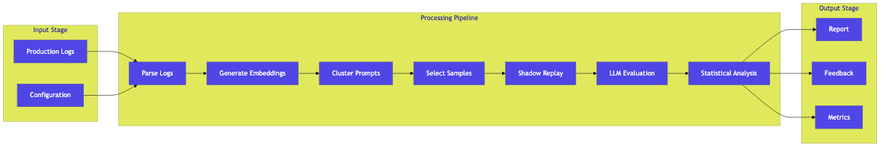
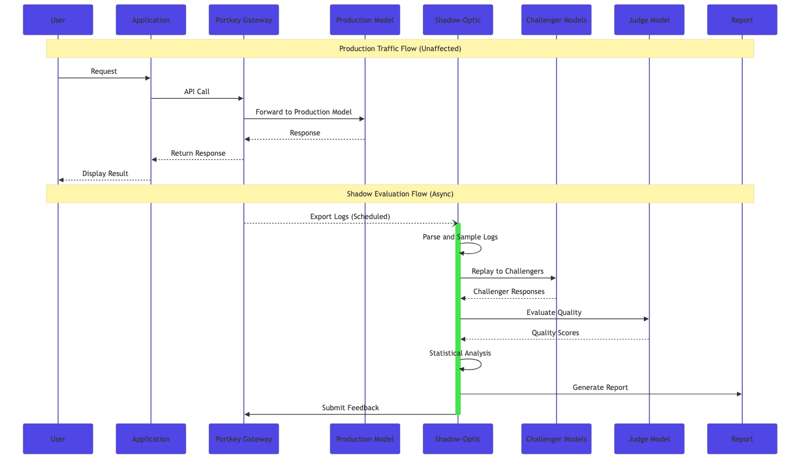
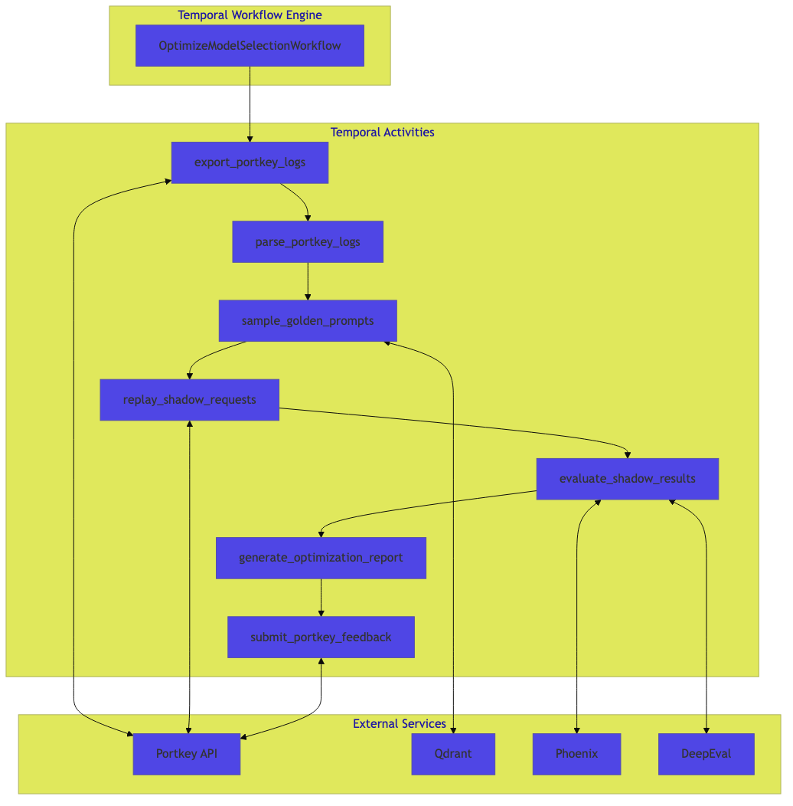

# Shadow-Optic Architecture

Technical Architecture Documentation

**Version:** 2.0.0  
**Last Updated:** January 2026

---

## Table of Contents

1. [Overview](#overview)
2. [System Architecture](#system-architecture)
3. [Component Design](#component-design)
4. [Data Flow](#data-flow)
5. [Workflow Orchestration](#workflow-orchestration)
6. [Integration Points](#integration-points)
7. [Resilience and Fault Tolerance](#resilience-and-fault-tolerance)
8. [Security Considerations](#security-considerations)

---

## Overview

Shadow-Optic is a production-grade optimization engine that evaluates alternative LLM models against production workloads without impacting end users. The system operates asynchronously, replaying historical traffic against challenger models and using LLM-as-Judge evaluation to generate actionable recommendations.

### Design Principles

- **Zero Production Impact**: All evaluation occurs asynchronously using historical logs
- **Cost Segregation**: Shadow testing costs are isolated from production budgets
- **Statistical Validity**: Semantic sampling ensures representative coverage with minimal compute
- **Fault Tolerance**: Durable workflows with automatic retry and state persistence
- **Explainability**: All recommendations include reasoning chains and confidence scores

---

## System Architecture

The following diagram illustrates the high-level system architecture:

### Architecture Layers

| Layer | Components | Responsibility |
|-------|------------|----------------|
| Ingestion | Portkey Logs Export, Parser | Collect and normalize production traffic |
| Sampling | Embeddings, Qdrant, K-Means | Select representative prompts efficiently |
| Replay | Portkey Gateway, Challenger Models | Execute shadow requests |
| Evaluation | DeepEval, Judge Model | Assess response quality |
| Decision | Statistical Analysis, Thompson Sampling | Generate recommendations |
| Observability | Arize Phoenix, Temporal UI | Monitor and debug |

---

## Component Design

### 1. Log Ingestion

The ingestion layer interfaces with the Portkey Logs Export API to retrieve production traffic. Logs are parsed and normalized into a standard format for downstream processing.

**Key Classes:**
- `export_portkey_logs`: Temporal activity for log retrieval
- `parse_portkey_logs`: Converts raw logs to ProductionTrace objects

**Design Decisions:**
- Async HTTP with connection pooling for throughput
- Incremental export with time-window filtering
- Automatic retry with exponential backoff

### 2. Semantic Sampling

The sampling layer reduces evaluation costs by selecting representative prompts rather than evaluating all traffic. Uses embedding-based clustering to identify both typical cases (cluster centroids) and edge cases (outliers).

**Key Classes:**
- `SemanticSampler`: Orchestrates the sampling pipeline
- K-Means clustering with configurable cluster count
- Outlier detection for edge case coverage

**Design Decisions:**
- 95% cost reduction through intelligent sampling
- Stratified selection ensures category coverage
- Configurable sampling rate per cluster

### 3. Shadow Replay

The replay layer executes golden prompts against challenger models through the Portkey Gateway. Uses Virtual Keys for cost segregation and rate limiting.

**Key Classes:**
- `replay_shadow_requests`: Temporal activity for parallel replay
- Semaphore-based concurrency control
- Error classification for failure analysis

**Design Decisions:**
- Parallel execution with configurable concurrency
- Per-model rate limiting to prevent throttling
- Retry logic with exponential backoff for transient failures

### 4. LLM-as-Judge Evaluation

The evaluation layer uses an LLM judge to assess challenger response quality against production baselines.

**Evaluation Metrics:**
- **Faithfulness**: Factual consistency with production response
- **Quality**: Helpfulness and completeness
- **Conciseness**: Response efficiency

**Key Classes:**
- `ShadowEvaluator`: Coordinates evaluation pipeline
- Integration with DeepEval framework
- Configurable judge model and thresholds

### 5. Decision Engine

The decision engine aggregates evaluation results and generates recommendations using statistical analysis.

**Recommendation Actions:**
- **SWITCH**: Challenger passes all thresholds with significant cost savings
- **MONITOR**: Promising results, continue evaluation
- **WAIT**: Insufficient data or marginal improvement
- **KEEP**: Production model remains optimal

**Key Classes:**
- `DecisionEngine`: Statistical analysis and recommendation generation
- Thompson Sampling for multi-armed bandit optimization
- Confidence interval calculation

---

## Data Flow

The following sequence diagram illustrates the data flow through the system:

### Processing Stages

1. **Log Export**: Scheduled retrieval of production logs from Portkey
2. **Parsing**: Normalization and validation of log data
3. **Embedding**: Vector representation of prompts
4. **Clustering**: Grouping similar prompts
5. **Sampling**: Selection of representative prompts
6. **Replay**: Execution against challenger models
7. **Evaluation**: Quality assessment via LLM judge
8. **Analysis**: Statistical aggregation
9. **Reporting**: Recommendation generation

---

## Workflow Orchestration

Shadow-Optic uses Temporal for durable workflow execution. Workflows define the high-level optimization process, while activities implement individual processing steps.

### Workflow Definition

The primary workflow `OptimizeModelSelectionWorkflow` coordinates the complete optimization pipeline:

| Activity | Description | External Dependencies |
|----------|-------------|----------------------|
| export_portkey_logs | Retrieve production logs | Portkey API |
| parse_portkey_logs | Parse and validate logs | None |
| sample_golden_prompts | Select representative prompts | Qdrant |
| replay_shadow_requests | Execute shadow requests | Portkey API |
| evaluate_shadow_results | Assess response quality | DeepEval |
| generate_optimization_report | Generate recommendations | None |
| submit_portkey_feedback | Submit feedback scores | Portkey API |

### Temporal Configuration

- **Task Queue**: `shadow-optic`
- **Workflow Timeout**: 1 hour
- **Activity Timeout**: 10 minutes per activity
- **Retry Policy**: Exponential backoff with maximum 5 attempts

---

## Integration Points

### Portkey AI Gateway

Shadow-Optic integrates with Portkey for log access, model routing, and feedback submission.

**Integration Points:**
- Logs Export API for historical traffic retrieval
- Model Catalog for challenger model access
- Virtual Keys for cost segregation
- Feedback API for evaluation result submission

### Qdrant Vector Database

Used for semantic embedding storage and similarity search during sampling.

**Integration Points:**
- Collection management for embedding storage
- K-Means clustering via vector operations
- Nearest neighbor search for outlier detection

### Arize Phoenix

Provides observability for LLM operations through OpenTelemetry integration.

**Integration Points:**
- Trace export via OTLP protocol
- Span attributes for evaluation metadata
- Dashboard for trace visualization

---

## Resilience and Fault Tolerance

### Retry Strategies

All external API calls implement retry logic with exponential backoff:

| Error Type | Retry Policy |
|------------|--------------|
| Rate Limit (429) | Retry with 2s, 4s, 8s, 16s, 30s delays |
| Server Error (5xx) | Retry up to 5 attempts |
| Timeout | Retry with increased timeout |
| Authentication (401) | No retry, fail immediately |
| Bad Request (400) | No retry, fail immediately |

### Adaptive Token Allocation

For reasoning models (GPT-5, o1, o3), the system implements adaptive token allocation to handle token exhaustion:

- Initial allocation: 8000 tokens
- First retry: 16000 tokens
- Second retry: 32000 tokens

### Circuit Breakers

Rate limiters prevent overwhelming external services:

| Provider | Rate Limit |
|----------|------------|
| OpenAI | 20 requests/minute |
| Anthropic | 60 requests/minute |
| Other | 60 requests/minute |

---

## Security Considerations

### API Key Management

- All API keys stored in environment variables
- Support for `.env` file loading via python-dotenv
- No keys logged or included in traces

### Cost Controls

- Virtual Keys provide budget isolation
- Per-request cost tracking
- Automatic budget alerts via Portkey

### Data Privacy

- Production logs processed in memory
- No persistent storage of raw request content
- Aggregated metrics only in reports
